# Aha 项目规划

> 版本：v1.0  
> 生成日期：2026-07-29  
> 作者：Aha Team

---

## 一、产品愿景

**Aha — 一个想法，十种成品。**

Aha 是一个基于 MCP 协议的"内容基础设施"，让任何 AI Agent 或用户，只需输入**一个主题**，就能快速扇出多种形态的内容成品（PPT / PDF / 口播稿 / 思维导图 / 小红书文案 / 视频脚本…）。

**核心差异化：**
- **MCP 协议原生**：不是一个 Web 工具，而是"可被 AI Agent 调用的能力服务"
- **一次输入，多形态扇出**：同一主题 → 多形态成品，保证内容一致性
- **可本地化 / 私有化**：基于 Spring Boot + Ollama 支持本地部署，满足政企合规诉求

---

## 二、总体时间线

```
2026年7月          2026年8月          2026年10月         2027年
  |                  |                  |                  |
  |--- 阶段 1 -------|--- 阶段 2 -------|--- 阶段 3 ------->|
  | 打磨核心体验       | 构建 Aha Studio   | 平台化 & 商业化    |
  | (技术债偿还 + 质量) | (可视化 + 扩容)   | (生态 + 开放)      |
```

| 阶段 | 时间区间 | 核心目标 |
|------|----------|----------|
| **阶段 1** | 2026.07 — 2026.08 | 打磨"生成 PPT"核心体验，补齐技术债，交付高质量 Demo |
| **阶段 2** | 2026.08 — 2026.10 | 构建 Aha Studio 前端，新增工具矩阵，跑通商业闭环 |
| **阶段 3** | 2026.10 — 长期 | 平台化：Prompt 市场 / 品牌套装 / 多 Agent 协作 / 私有化部署 |

---

## 三、阶段 1 — 打磨核心体验 (2026.07 — 2026.08)

### 3.1 目标

- 提升 PPT 视觉质量（从"机器味"到"可交付"）
- 重构核心代码，降低维护成本
- 增加 PDF 工具作为 PPT 的轻量替代
- 建立缓存机制，优化响应速度

### 3.2 任务清单

| # | 任务 | 优先级 | 规划时间 | 状态 |
|---|------|--------|----------|------|
| T1 | 重构 `ContentGenerator`：ChatClient Bean 化 + Prompt 外部化 + BeanOutputConverter | 🔴 最高 | 2026-07-29 | ✅ 已完成 |
| T2 | `PptGenerator` 引入主题系统（Theme）和布局模板（Layout） | 🔴 最高 | 2026-07-30 | ✅ 已完成 |
| T3 | 新增 `generate_topic_pdf` 工具（PdfGenerator） | 🟡 高 | 2026-07-31 | ✅ 已完成 |
| T4 | Pexels 搜索加缓存（Caffeine / 本地缓存） | 🟡 高 | 2026-08-01 | ✅ 已完成 |
| T5 | README 增加生成效果对比图（Before / After） | 🟢 中 | 2026-08-02 | ✅ 已完成 |

---

### 3.3 任务详情与流程图

---

#### 任务 T1：重构 `ContentGenerator`

**问题：**
- 每次调用都 `ChatClient.builder(chatModel).build()`，重复创建实例
- Prompt 硬编码在 Java 代码里，调优需要改代码、发版
- 用 `Pattern.compile + Jackson` 手写解析 JSON，脆弱且冗余

**修改流程：**

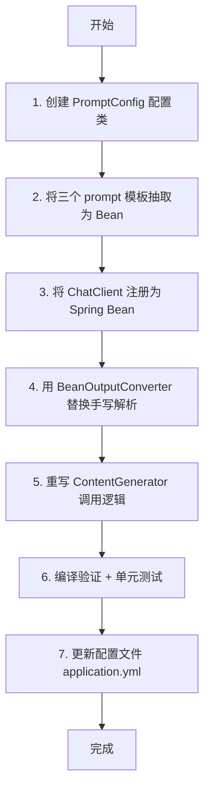

**涉及文件：**
| 文件 | 操作 |
|------|------|
| `config/PromptConfig.java` | 🆕 新建 |
| `service/ContentGenerator.java` | ✏️ 重构 |
| `resources/application.yml` | ✏️ 新增 prompt 配置 |
| `pom.xml` | ✏️ 新增 `spring-ai-starter-model-openai` 依赖检查 |

**具体改动要点：**

```
Before:
┌─────────────────────────────────────────────┐
│ ContentGenerator.generateOutline(topic, n) │
│   1. ChatClient.builder(chatModel).build() │  ← 每次新建
│   2. String.format(prompt, topic, n)       │  ← 硬编码
│   3. chatClient.prompt().user(...).content()│
│   4. extractJsonArray(text)                │  ← 正则解析
│   5. objectMapper.readValue(...)           │
└─────────────────────────────────────────────┘

After:
┌─────────────────────────────────────────────┐
│ ContentGenerator.generateOutline(topic, n) │
│   1. chatClient.prompt()                    │  ← 复用 Bean
│   2. promptTemplate.render(vars)            │  ← 外部模板
│   3. .call(entityConverter)                 │  ← 结构化输出
│   4. 返回 List<SlideOutline>                │  ← 类型安全
└─────────────────────────────────────────────┘
```

---

#### 任务 T2：`PptGenerator` 主题与布局系统

**问题：**
- 封面 + 左右图文布局写死，无法适配不同内容风格
- 颜色、字体、字号硬编码在 `PptGenerator.java` 中

**修改流程：**

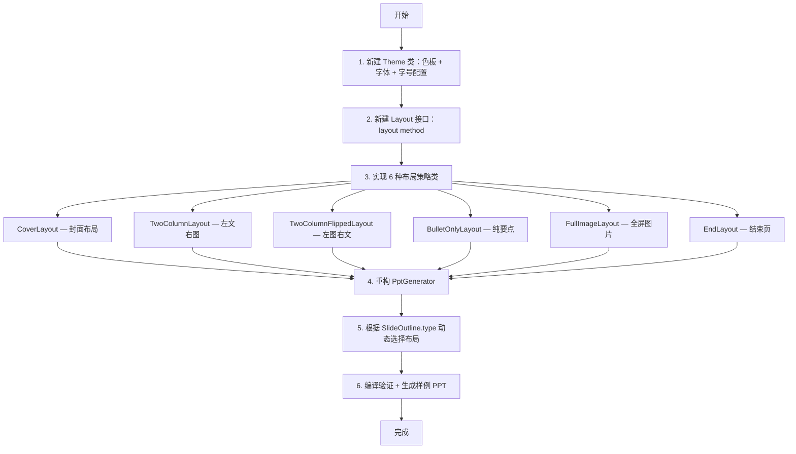

**涉及文件：**
| 文件 | 操作 |
|------|------|
| `model/Theme.java` | 🆕 新建 |
| `model/LayoutType.java` | 🆕 新建（枚举） |
| `service/layout/Layout.java` | 🆕 新建（接口） |
| `service/layout/CoverLayout.java` | 🆕 新建 |
| `service/layout/TwoColumnLayout.java` | 🆕 新建 |
| `service/layout/TwoColumnFlippedLayout.java` | 🆕 新建 |
| `service/layout/BulletOnlyLayout.java` | 🆕 新建 |
| `service/layout/FullImageLayout.java` | 🆕 新建 |
| `service/layout/EndLayout.java` | 🆕 新建 |
| `service/PptGenerator.java` | ✏️ 重构 |
| `model/SlideOutline.java` | ✏️ 新增 `layoutType` 字段 |

**布局视觉对比：**

```
Before (单一布局):                    After (动态布局):
┌─────────────────────┐              ┌─────────────────────┐
│ 标题                 │              │ [封面布局]           │
│─────────────────────│              │                     │
│          │          │              │    主题标题         │
│  要点    │   图片   │              │                     │
│          │          │              │    副标题           │
│          │          │              └─────────────────────┘
│          │          │
└─────────────────────┘              ┌─────────────────────┐
                                     │ [左右布局]           │
                                     │                     │
                                     │  标题  │   图片     │
                                     │  要点  │            │
                                     │        │            │
                                     └─────────────────────┘

                                     ┌─────────────────────┐
                                     │ [全屏图片布局]       │
                                     │                     │
                                     │   ┌───────────┐    │
                                     │   │           │    │
                                     │   │  图片 +   │    │
                                     │   │  叠加标题 │    │
                                     │   │           │    │
                                     │   └───────────┘    │
                                     └─────────────────────┘
```

---

#### 任务 T3：新增 `generate_topic_pdf` 工具

**目标：** 提供 PPT 的轻量替代方案，覆盖"快速阅读文档"场景

**修改流程：**

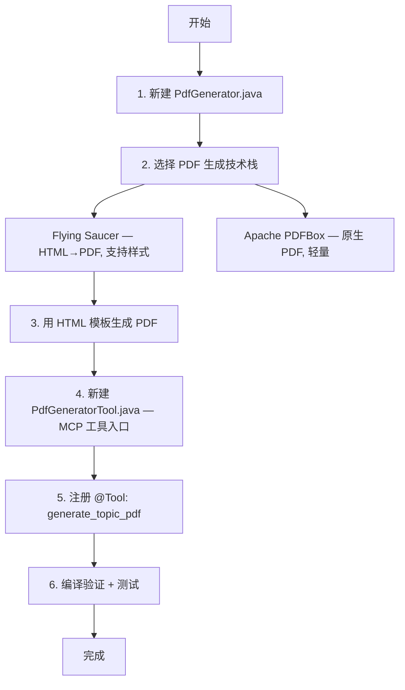

**涉及文件：**
| 文件 | 操作 |
|------|------|
| `service/PdfGenerator.java` | 🆕 新建 |
| `tool/PdfGeneratorTool.java` | 🆕 新建 |
| `pom.xml` | ✏️ 新增 PDF 依赖（Flying Saucer 或 PDFBox） |
| `docs/tools/generate_topic_pdf.md` | 🆕 新建工具文档 |

**调用链：**

```
generate_topic_pdf(topic, format)
        │
        ├─ ContentGenerator.generateOutline(topic, pages)  ← 复用
        │
        └─ PdfGenerator.generate(topic, outlines)
              ├─ 渲染为 HTML（带主题样式）
              └─ Flying Saucer → .pdf
                    │
                    └─ 返回 .pdf 文件路径
```

---

#### 任务 T4：Pexels 搜索加缓存

**问题：** 同一主题多次调用重复消耗 Pexels API 配额

**修改流程：**

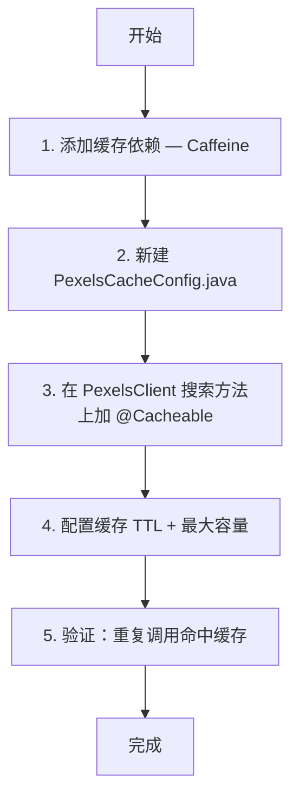

**涉及文件：**
| 文件 | 操作 |
|------|------|
| `config/PexelsCacheConfig.java` | 🆕 新建 |
| `service/PexelsClient.java` | ✏️ 加 `@Cacheable` 注解 |
| `pom.xml` | ✏️ 新增 `caffeine` 依赖 |
| `resources/application.yml` | ✏️ 新增缓存配置 |

**缓存策略：**

```
缓存 Key:  pexels:search:{topic}:{perPage}
TTL:       30 分钟（防止主题搜索结果变化）
容量:      最多 500 条（防止内存泄漏）

调用流程:
┌──────────┐    命中?    ┌──────────┐
│ Pexels   │──────────→ │ 缓存命中 │ → 直接返回
│ Client   │            └──────────┘
└────┬─────┘
     │ 未命中
     ▼
┌──────────┐
│ 调 API   │ → 写入缓存 → 返回
└──────────┘
```

---

#### 任务 T5：README 增加效果对比图

**修改流程：**

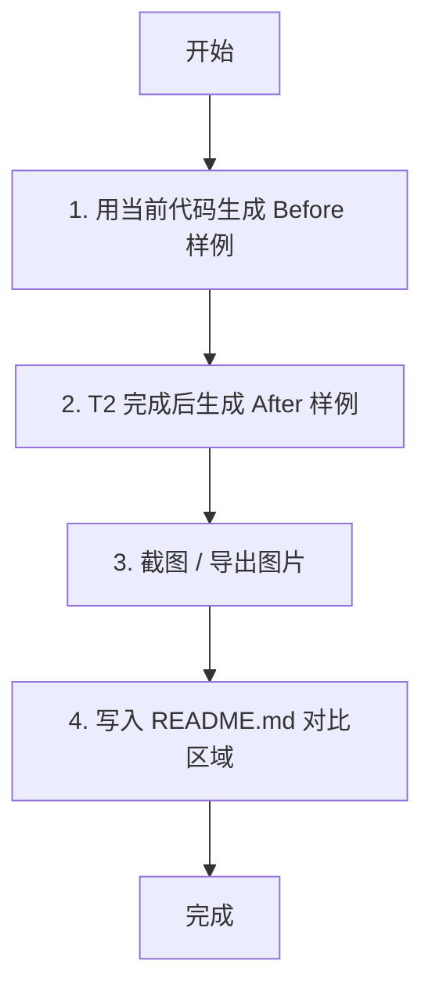

**涉及文件：**
| 文件 | 操作 |
|------|------|
| `README.md` | ✏️ 新增"效果展示"章节 |
| `docs/assets/before-ppt.png` | 🆕 新建 |
| `docs/assets/after-ppt.png` | 🆕 新建 |

---

## 四、阶段 2 — 构建 Aha Studio (2026.08 — 2026.10)

### 4.1 目标

- 打造可视化前端（Aha Studio）
- 扩展工具矩阵，覆盖更多内容场景
- 跑通免费 + 订阅的商业闭环

### 4.2 任务清单

| # | 任务 | 优先级 | 规划时间 | 状态 |
|---|------|--------|----------|------|
| T6 | 搭建 Aha Studio 前端（Web / Next.js） | 🔴 最高 | 2026-08-15 | ⬜ 待开始 |
| T7 | 新增 `generate_social_posts` 工具（小红书/公众号文案） | 🟡 高 | 2026-09-01 | ⬜ 待开始 |
| T8 | 新增 `generate_video_script` 工具（分镜脚本 + 旁白） | 🟡 高 | 2026-09-15 | ⬜ 待开始 |
| T9 | 历史记录 + 模板市场（保存 & 复用） | 🟡 高 | 2026-09-20 | ⬜ 待开始 |
| T10 | 计费系统：免费额度 + 订阅制 | 🟢 中 | 2026-10-01 | ⬜ 待开始 |

### 4.3 任务流程图

---

#### 任务 T6：搭建 Aha Studio 前端

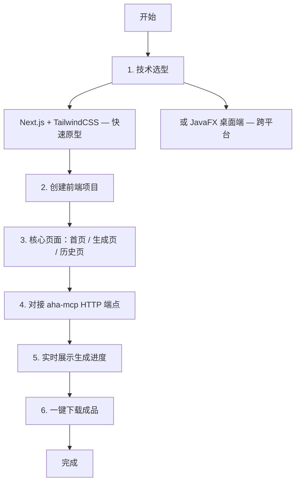

**Aha Studio 页面结构：**

```
┌─────────────────────────────────────────────┐
│  Aha Studio                                 │
├─────────────────────────────────────────────┤
│                                             │
│  ┌─────────────────────────────────────┐    │
│  │  输入主题：[____________________]   │    │
│  │  选择成品：☑ PPT ☑ PDF ☑ 口播稿   │    │
│  │           ☑ 思维导图 ☑ 小红书      │    │
│  │  [✨ 一键生成]                       │    │
│  └─────────────────────────────────────┘    │
│                                             │
│  ┌─────────────────────────────────────┐    │
│  │  生成进度（实时流）                   │    │
│  │  ████████░░░░ 60% 正在生成大纲...   │    │
│  └─────────────────────────────────────┘    │
│                                             │
│  ┌─────────────────────────────────────┐    │
│  │  成品下载                            │    │
│  │  📊 PPT  📄 PDF  📝 口播稿  🧠 导图 │    │
│  └─────────────────────────────────────┘    │
│                                             │
└─────────────────────────────────────────────┘
```

---

#### 任务 T7：`generate_social_posts` 工具

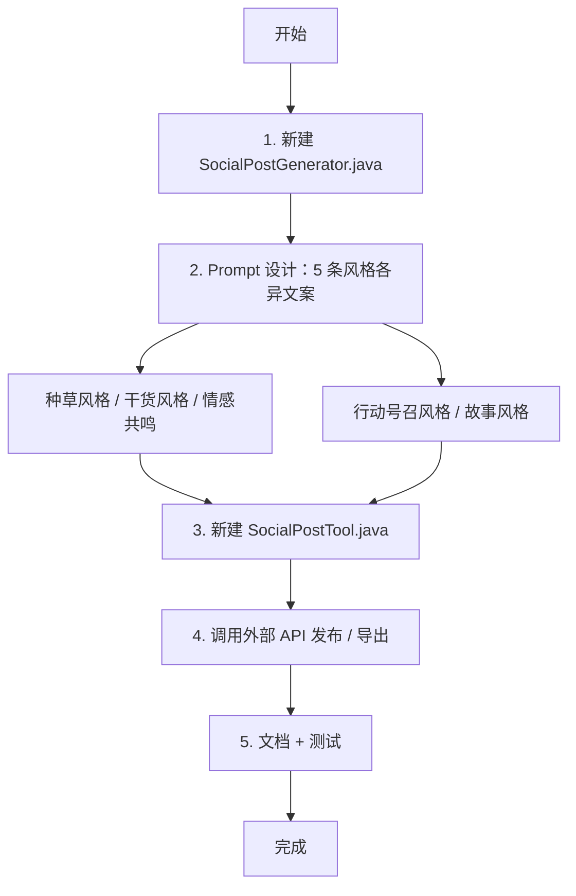

**涉及文件：**
| 文件 | 操作 |
|------|------|
| `service/SocialPostGenerator.java` | 🆕 新建 |
| `tool/SocialPostTool.java` | 🆕 新建 |
| `model/SocialPost.java` | 🆕 新建 |
| `docs/tools/generate_social_posts.md` | 🆕 新建 |

---

#### 任务 T8：`generate_video_script` 工具

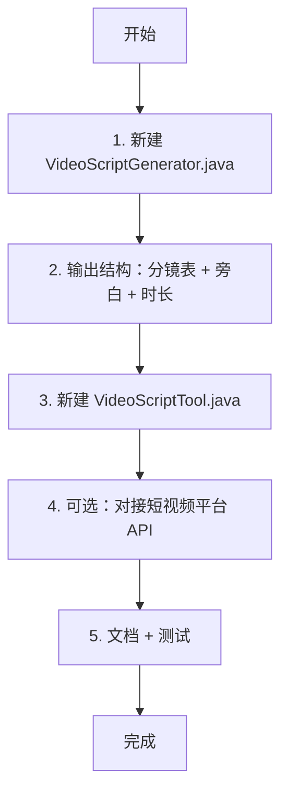

**输出格式示例：**
```markdown
# 视频脚本：主题

## 分镜 1 (0:00-0:05)
- 画面：产品特写
- 旁白：开头钩子...
- 字幕：...

## 分镜 2 (0:05-0:20)
- 画面：用户场景
- 旁白：核心论点 1...
- 字幕：...
```

---

#### 任务 T9：历史记录 + 模板市场

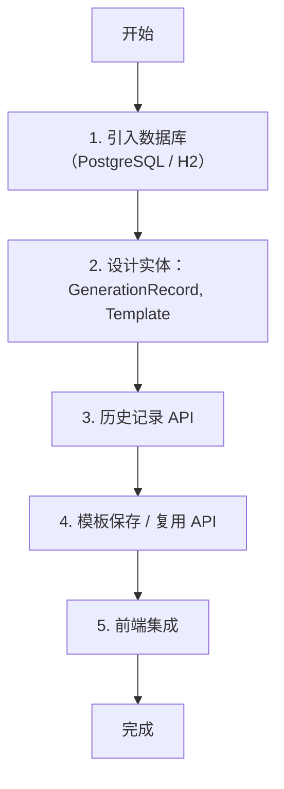

---

#### 任务 T10：计费系统

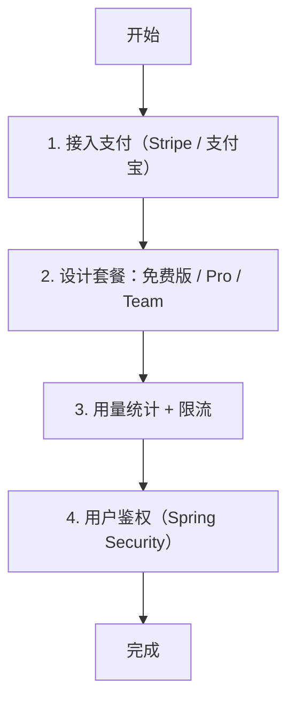

**套餐设计：**

| 套餐 | 价格 | 配额 |
|------|------|------|
| 免费版 | ¥0 | 每月 20 次生成 |
| Pro | ¥99/月 | 无限生成 + 高级主题 |
| Team | ¥299/月 | 5 人协作 + API 访问 |

---

## 五、阶段 3 — 平台化 (2026.10 — 长期)

### 5.1 目标

- 开放生态，让社区贡献内容
- 支持企业私有化部署
- 多 Agent 协作场景

### 5.2 任务清单

| # | 任务 | 优先级 | 规划时间 | 状态 |
|---|------|--------|----------|------|
| T11 | Prompt 市场（社区模板） | 🟡 高 | 2026-11-01 | ⬜ 待开始 |
| T12 | 品牌套装（企业品牌定制） | 🟡 高 | 2026-11-15 | ⬜ 待开始 |
| T13 | 多 Agent 协作模式 | 🟢 中 | 2026-12-01 | ⬜ 待开始 |
| T14 | 私有化部署方案（Docker + Ollama） | 🟢 中 | 2026-12-15 | ⬜ 待开始 |

### 5.3 任务流程图

---

#### 任务 T11：Prompt 市场

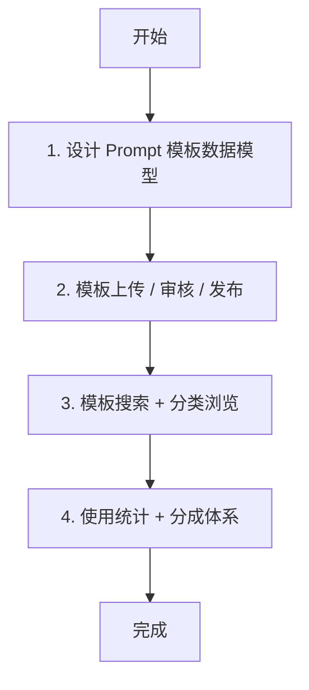

---

#### 任务 T12：品牌套装

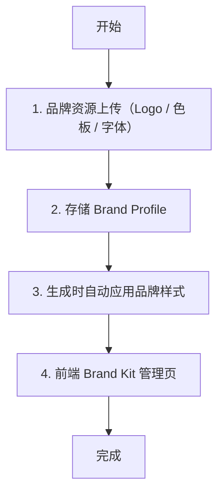

---

#### 任务 T13：多 Agent 协作模式

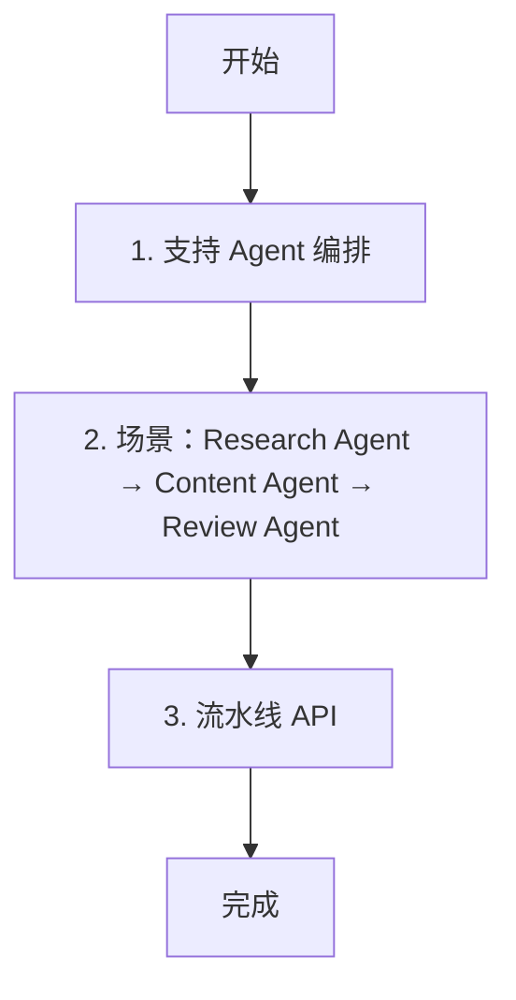

**协作示例：**
```
用户："帮我做一份关于新能源汽车的深度报告"

Agent 编排：
┌──────────────┐     ┌──────────────┐     ┌──────────────┐
│ Research     │────→│ Aha Content  │────→│ Review       │
│ Agent        │     │ Agent (MCP)  │     │ Agent        │
│ (搜索+分析)  │     │ (PPT+PDF+稿) │     │ (质量审核)   │
└──────────────┘     └──────────────┘     └──────────────┘
```

---

#### 任务 T14：私有化部署

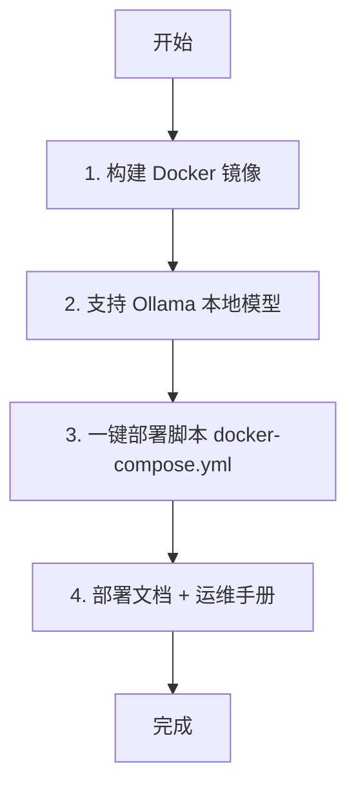

---

## 六、依赖关系总览

```
T1 (重构 ContentGenerator)
 ├── T2 (PptGenerator 布局)     ← 依赖 T1 的结构化输出
 ├── T3 (PDF 工具)              ← 依赖 T1 的 ContentGenerator Bean
 └── T4 (Pexels 缓存)           ← 独立，可并行

T5 (README 对比图)              ← 依赖 T2 完成

T6 (Aha Studio 前端)            ← 依赖阶段 1 全部完成
T7-T10 (阶段 2 任务)            ← 依赖 T6 启动后并行

T11-T14 (阶段 3 任务)           ← 依赖阶段 2 跑通
```

**关键路径：** T1 → T2 → T5 → T6 → 阶段 2 → 阶段 3

---

## 七、风险与应对

| 风险 | 影响 | 应对 |
|------|------|------|
| Pexels API 配额耗尽 | PPT 生成失败 | T4 缓存 + 备用图片源（Unsplash API） |
| LLM 输出格式不稳定 | JSON 解析失败 | T1 用 BeanOutputConverter 结构化输出 |
| Apache POI 生成 PPT 视觉效果有限 | 用户体验差 | T2 布局系统 + 考虑用 PptxGenJS 替代 |
| 多 Agent 场景复杂度超预期 | 延期 | 阶段 3 先做单机版，再扩展协作 |
| 企业私有化部署需求 | 资源投入 | 先开源 Docker Compose 方案，后续做 K8s Operator |

---

## 八、里程碑检查点

| 里程碑 | 目标日期 | 验收标准 |
|--------|----------|----------|
| **M1: 质量跃迁** | 2026-08-02 | T1-T5 全部完成，生成的 PPT 视觉质量达标 |
| **M2: Studio 发布** | 2026-10-01 | T6-T10 完成，Aha Studio 可对外 Beta |
| **M3: 平台化启动** | 2026-12-15 | T11-T14 完成，支持私有化部署 |

---

*文档持续更新中，具体任务安排以实际进度为准。*